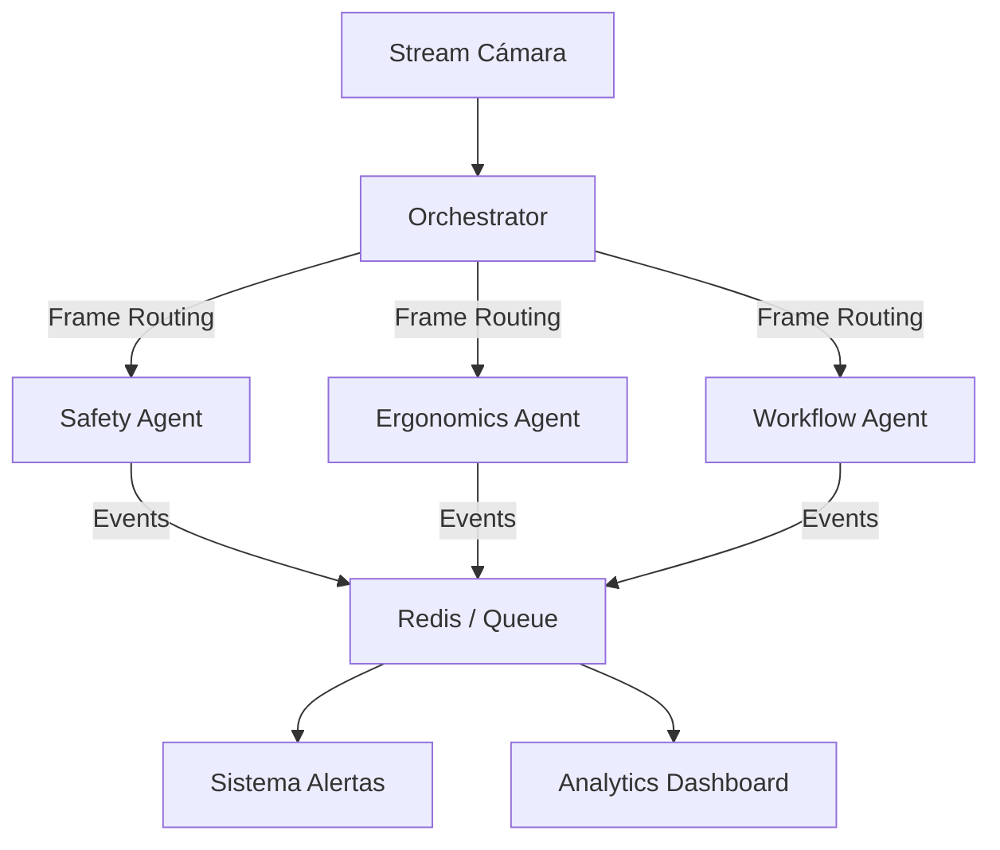

# UiFlou - Desafío Técnico Computer Vision

Soluciones a problemas de procesamiento de video, streaming RTSP y arquitectura multiagente.

## 📦 Instalación

```bash
# Crear entorno virtual
python -m venv venv

# Activar (Windows)
.\venv\Scripts\Activate.ps1

# Instalar dependencias
pip install -r requirements.txt
```

## ☁️ Configuración AWS
Para habilitar la subida de archivos a S3 (utilizado en Problema 1), es necesario configurar las siguientes variables de entorno. Puedes hacer esto en tu terminal o setearlas en tu sistema.

**Variables requeridas:**
- `AWS_ACCESS_KEY_ID`: Tu access key ID
- `AWS_SECRET_ACCESS_KEY`: Tu secret access key
- `AWS_REGION`: Región de AWS (ej: `us-east-1`)

**Configuración Powershell:**
```powershell
$env:AWS_ACCESS_KEY_ID="TU_ACCESS_KEY"
$env:AWS_SECRET_ACCESS_KEY="TU_SECRET_KEY"
$env:AWS_REGION="us-east-1"
```

> **Nota:** El nombre del bucket se define normalmente en `config.json` dentro del directorio del problema.

## 🚀 Uso

```bash
python launcher.py
```

El launcher ofrece una interfaz gráfica (GUI) para gestionar todos los desafíos.

**Características del Launcher:**
- **Selección de Video:** Permite elegir un archivo MP4. Si no se selecciona ninguno, los problemas intentarán usar la webcam por defecto.
- **Botones Dedicados:** Un botón para cada problema (1, 2, 3 y 4).
- **Ejecución Independiente:** Cada problema se ejecuta en su propio proceso, manteniendo la consola libre para logs.

> **Nota:** El "Problema 3" ignora la selección de video del launcher ya que se configura vía `config.yaml`. El "Problema 4" está diseñado para usar siempre la webcam directamente.

---

## Problema 1: Procesamiento de Video

**Objetivo:** Pose estimation + HAR + Tracking + Ángulos + Export S3

### Herramientas
| Componente | Tecnología |
|------------|------------|
| Pose Estimation | YOLOv8-Pose |
| HAR | Ventana temporal 9s + clasificación |
| Tracking | ByteTrack (integrado YOLO) |
| Ángulos | Cálculo geométrico keypoints |
| Export | JSON cada 1s + Video MP4 |
| Storage | AWS S3 (boto3) |

### Ejecución Manual
```bash
cd "Problema 1"
# Usar video
python main.py video.mp4

# Usar webcam (por defecto)
python main.py
```

> **Nota:** Al iniciar y finalizar, el script puede preguntar si deseas limpiar los archivos JSON generados anteriormente.

---

## Problema 2: Streaming RTSP

**Objetivo:** Pose estimation + Object detection sobre stream RTSP

### Herramientas
| Componente | Tecnología |
|------------|------------|
| Object Detection | YOLOv8n + Tracking |
| Pose Estimation | YOLOv8-Pose + Tracking |
| Video Output | MP4 (H.264) |
| Data Output | JSON por frame |

### Estructura del Sistema
```
Problema 2/
├── main.py              # Entry point
├── processors/
│   ├── detector.py      # Object detection + tracking
│   ├── pose_estimator.py # Pose + tracking
│   ├── video_writer.py  # Export video
│   └── data_exporter.py # Export JSON
├── output/              # JSONs
└── video_outputs/       # Videos procesados
```

### Formato de Video
- **Codec:** H.264
- **Container:** MP4
- **Resolución:** Original del source

### Formato de Datos
```json
{
  "frame_id": 0,
  "detections": [{"class": "person", "conf": 0.95, "bbox": [...], "track_id": 1}],
  "poses": [{"keypoints": [...], "track_id": 1}]
}
```

### Ejecución Manual
```bash
cd "Problema 2"

# RTSP Stream
python main.py --source rtsp://usuario:password@ip:port/stream

# Video Local
python main.py --source video.mp4

# Webcam (default)
python main.py
```

**Argumentos Adicionales:**
- `--no-display`: Ejecuta sin mostrar ventana (headless).
- `--output-dir`: Cambiar directorio de JSONs.
- `--video-output-dir`: Cambiar directorio de video.

---

## Problema 3: Streaming Multicámara

**Objetivo:** Sistema de streaming para múltiples cámaras RTSP (mín. 3)

### Herramientas
| Componente | Tecnología |
|------------|------------|
| Streaming | OpenCV + Threading |
| Config | YAML dinámico |
| API REST | FastAPI + Uvicorn |
| Display | Grid layout OpenCV |

### Estructura
```
Problema 3/
├── main.py           # Entry point
├── camera_manager.py # Gestión de cámaras
├── camera_stream.py  # Stream individual
├── api.py            # REST API
└── config.yaml       # Configuración
```

### Modificación de Parámetros en Runtime
**Solución propuesta:** REST API (FastAPI)
- `GET /cameras` - Listar cámaras activas
- `POST /cameras` - Agregar cámara
- `DELETE /cameras/{id}` - Remover cámara
- `PUT /cameras/{id}/params` - Modificar parámetros
- `POST /recording/start` - Iniciar grabación
- Hot-reload de `config.yaml` con tecla 'r'

### ¿Real-time o Near Real-time?
**Near Real-time.** Razones:
1. **Buffering OpenCV:** Latencia de ~50-200ms por decode
2. **Threading overhead:** Sincronización entre streams
3. **Network latency:** RTSP agrega ~100-500ms
4. **Display sync:** Grid rendering introduce delay

Para real-time estricto se requeriría: GStreamer, hardware decode (NVDEC), zero-copy buffers.

### Ejecución Manual
```bash
cd "Problema 3"
python main.py --config config.yaml
```

**Teclas en Runtime:**
- `q`: Salir
- `r`: Recargar configuración (Hot-reload de `config.yaml`)

**Argumentos:**
- `--no-api`: Desactiva el servidor REST.
- `--no-display`: Ejecuta sin interfaz gráfica.

---

## Problema 4: Agentes

Este desafío consta de dos partes: una **propuesta teórica** para un sistema completo y una **implementación simplificada** de un solo agente.

### 🧠 Parte A: Propuesta Teórica (Arquitectura)
*Respuesta a: ¿Qué agentes usarías? ¿Qué arquitectura? ¿Qué tecnologías?*

Para un entorno productivo real, propongo una arquitectura distribuida y desacoplada:

**1. Agentes Propuestos:**
*   **Safety Agent:** Detecta EPP (casco, chaleco, gafas) y zonas prohibidas.
*   **Ergonomics Agent:** Analiza posturas (ángulos de espalda, repetición de movimientos) para prevenir lesiones.
*   **Workflow Agent:** Identifica herramientas en uso y mide tiempos de ciclo (Time-Motion study).
*   **Quality Agent:** Inspección visual del resultado del trabajo (si es visible).

**2. Arquitectura Multiagente:**
Diseño basado en **Orquestador + Micro-agentes**:



**3. Stack Tecnológico Sugerido:**
*   **Orquestación:** Ray (ideal para workloads distribuidos de CV/ML) o Apache Storm/Flink para procesamiento de streams.
*   **Comunicación:** Redis Streams o RabbitMQ (baja latencia).
*   **Modelos:**
    *   *YOLOv8-Pose* (Ergonomía)
    *   *YOLOv8-World* (Detección open-vocabulary de herramientas)
    *   *MediaPipe* (Gestos finos de manos)

---

### 💻 Parte B: Implementación de Ejemplo (Agente Simple)
*Respuesta a: Código de ejemplo de un agente (muy simple)*

Como solicita el enunciado ("código muy simple"), se implementó un script monolítico (`simple_agent.py`) que condensa capacidades básicas en un solo proceso. **No es la arquitectura completa**, sino una demostración de capacidades de bajo nivel.

**Capacidades del Demo:**
*   **Detección de Manos:** MediaPipe Hands (Coord. 21 puntos).
*   **Detección de Pose:** MediaPipe Pose (Esqueleto completo).
*   **Detección de Objetos:** YOLOv8 Nano (Personas, botellas, herramientas).
*   **Lógica de Negocio (Mock):** `check_safety_rules()` simula alertas si detecta manos o falta de operador.

**Ejecución:**
```bash
cd "Problema 4"
# Requiere webcam
python simple_agent.py
```


### 📝 Trazabilidad y Artifacts (.md)
Es fundamental guardar las bitacoras generadas por los agentes (archivos `.md`) para mantener una trazabilidad completa de las acciones realizadas. Esto permite:
1.  **Auditoría de Decisiones:** Entender por qué un agente tomó cierta decisión en un momento dado.
2.  **Contexto para Futuros Agentes:** Un agente puede leer estos archivos para comprender el contexto histórico, identificar problemas previos y evitar repetir errores, mejorando la continuidad del desarrollo.

## 📋 Dependencias Consolidadas

```txt
ultralytics>=8.0.0
opencv-python>=4.8.0
numpy>=1.24.0
boto3>=1.28.0
pyyaml>=6.0
fastapi>=0.104.0
uvicorn>=0.24.0
pydantic>=2.0.0
mediapipe>=0.10.21
```
